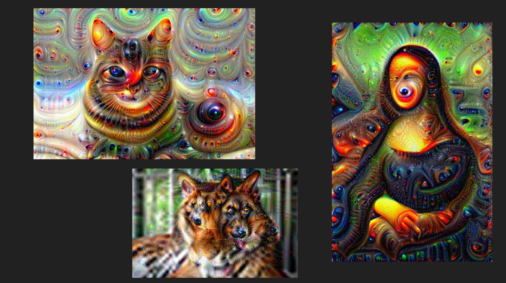

# ImageProcessingFinal

Use DeepDream/DeepDream.ipynb jupyter notebook to try the deep dream code yourself.

DeepDream/DeepDreamFlaskServer.py and DeepDream/DeepDream.py contains a copy the the code from the jupyter notebook, but it allows it to run as a REST api. FrontEnd/index.html contains code that will communicate with the flask server.